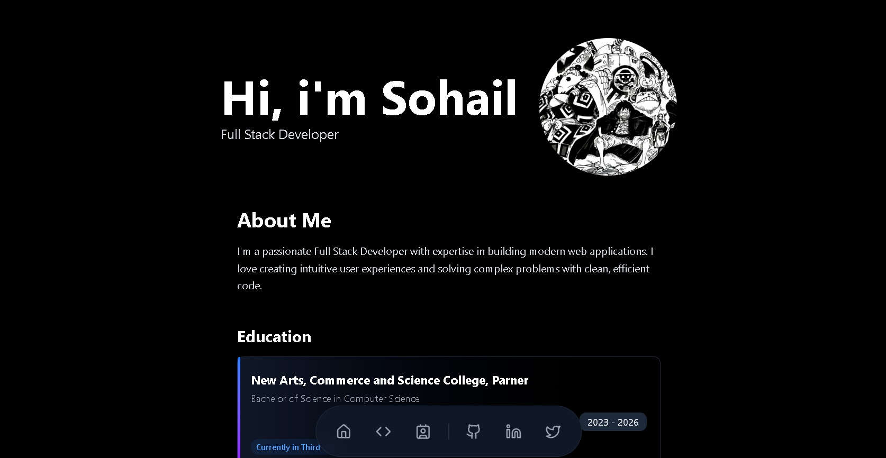
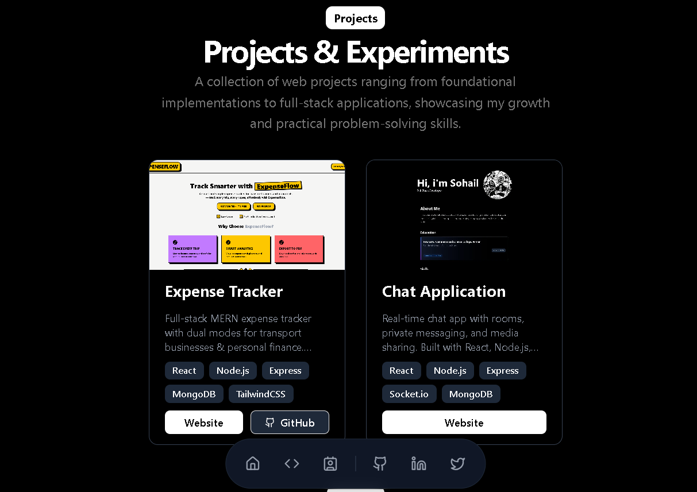
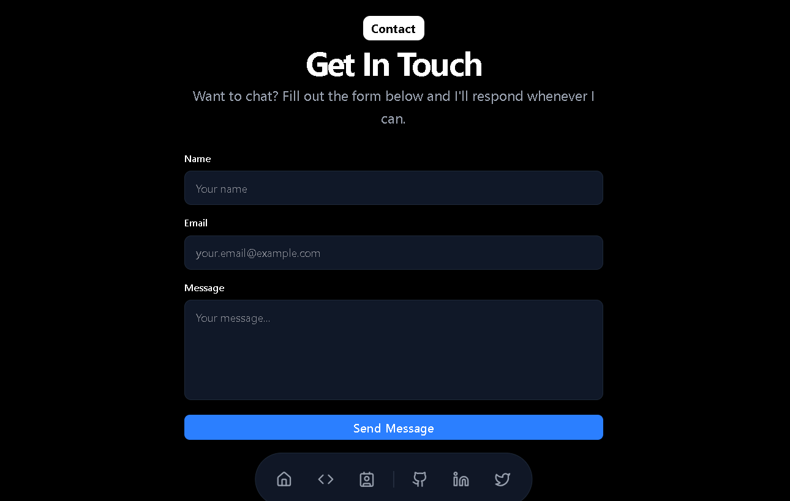

# 🚀 Sohail Shaikh - Portfolio Website

A modern, responsive portfolio website built with Next.js 16, showcasing my projects, skills, and experience as a Full Stack Developer.



## ✨ Features

- 🎨 **Modern Dark Theme** - Sleek black and gray color scheme with gradient accents
- 📱 **Fully Responsive** - Optimized for all device sizes (mobile, tablet, desktop)
- 🎯 **Smooth Navigation** - Floating toolbar with smooth scrolling to sections
- 💼 **Project Showcase** - Display of featured projects with live demos and GitHub links
- 📧 **Contact Form** - Integrated contact form with email functionality using Nodemailer
- 🛠️ **Skills Section** - Organized display of frontend, backend, and tool proficiencies
- 🎓 **Education Information** - Current academic background and achievements
- 🔗 **Social Links** - Quick access to GitHub, LinkedIn, and Twitter profiles

## 📸 Screenshots

### Projects Section


### Contact Section


## 🛠️ Tech Stack

### Frontend
- **Next.js 16.1.0** - React framework with App Router
- **React 19.2.3** - UI library
- **TypeScript** - Type-safe development
- **Tailwind CSS 4** - Utility-first CSS framework
- **Radix UI** - Accessible component primitives
- **Lucide React** - Beautiful icon library

### Backend
- **Node.js** - Server runtime
- **Nodemailer** - Email sending functionality
- **Next.js API Routes** - Serverless API endpoints

### Development Tools
- **ESLint** - Code linting
- **PostCSS** - CSS processing
- **TypeScript 5** - Type checking

## 🚀 Getting Started

### Prerequisites

- Node.js 18+ installed on your machine
- npm, yarn, pnpm, or bun package manager

### Installation

1. Clone the repository:
```bash
git clone https://github.com/sohailshaikh7860/portofolio.git
cd portofolio
```

2. Install dependencies:
```bash
npm install
# or
yarn install
# or
pnpm install
```

3. Run the development server:
```bash
npm run dev
# or
yarn dev
# or
pnpm dev
```

4. Open [http://localhost:3000](http://localhost:3000) in your browser to see the result.

### Build for Production

```bash
npm run build
npm start
```

## 📁 Project Structure

```
portofolio/
├── app/
│   ├── api/
│   │   └── contact/
│   │       └── route.ts          # Contact form API endpoint
│   ├── globals.css               # Global styles
│   ├── layout.tsx                # Root layout
│   └── page.tsx                  # Home page
├── components/
│   ├── layouts/
│   │   ├── Contact.tsx           # Contact form component
│   │   ├── FloatingToolbar.tsx   # Navigation toolbar
│   │   ├── HeroSection.tsx       # Main hero section
│   │   └── ProjectCard.tsx       # Project card component
│   └── ui/
│       ├── button.tsx            # Reusable button component
│       └── card.tsx              # Reusable card component
├── constants/
│   ├── projects.ts               # Project data
│   └── skills.ts                 # Skills data
├── lib/
│   └── utils.ts                  # Utility functions
├── public/
│   └── Images/                   # Image assets
└── README.md
```

## 🎯 Key Features Breakdown

### Floating Toolbar
- Smooth scroll navigation to different sections
- Links to social media profiles (GitHub, LinkedIn, Twitter)
- Responsive design with hover effects and tooltips
- Fixed positioning for easy access

### Projects Section
- **Expense Tracker** - Full-stack MERN application with JWT auth and Razorpay integration
- **Chat Application** - Real-time chat with Socket.io, rooms, and media sharing
- Each project includes:
  - Live demo link
  - GitHub repository link
  - Technology stack badges
  - Project description

### Skills Display
- **Frontend:** React, Next.js, JavaScript, TypeScript, Tailwind CSS
- **Backend:** Node.js, Express, MongoDB, SQL, RESTful APIs
- **Tools:** Git, GitHub, VS Code, Postman

### Contact Form
- Server-side email handling
- Form validation
- Responsive design
- Error handling

## 🎨 Customization

### Updating Projects
Edit `constants/projects.ts` to add or modify projects:

```typescript
export const projects = [
  {
    id: 1,
    title: "Your Project",
    description: "Project description",
    imageUrl: "/project-image.png",
    projectUrl: "https://project-url.com",
    githubUrl: "https://github.com/username/repo",
    technologies: ["React", "Node.js"]
  }
]
```

### Updating Skills
Edit `constants/skills.ts` to modify your skills:

```typescript
export const skills = {
  frontend: ["React", "Next.js", ...],
  backend: ["Node.js", "Express", ...],
  tools: ["Git", "VS Code", ...]
}
```

## 🔗 Links

- **GitHub:** [@sohailshaikh7860](https://github.com/sohailshaikh7860)
- **LinkedIn:** [Sohail Shaikh](https://linkedin.com/in/sohailshaikh786)
- **Twitter:** [@Sohaildevs](https://twitter.com/Sohaildevs)

## 📝 License

This project is open source and available for personal use.

## 👨‍💻 About Me

Hi! I'm Sohail Shaikh, a passionate Full Stack Developer currently pursuing Bachelor of Science in Computer Science at New Arts, Commerce and Science College, Parner (2023-2026). I love creating intuitive user experiences and solving complex problems with clean, efficient code.

## 🤝 Contributing

Feel free to fork this project and customize it for your own portfolio! If you find any bugs or have suggestions, please open an issue.

## 📧 Contact

For any inquiries, feel free to reach out through the contact form on the website or connect with me on social media.
